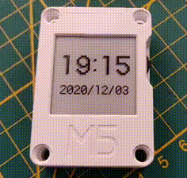

# M5Stack CoreInk NTP Clock

Testing ESP32 M5Stack CoreInk device with a NTP sync clock


# Features

<a href="https://www.youtube.com/watch?v=FnVP3CCfwGk" target="_blank"></a>

- [x] eInk display refresh without any blink
- [x] shutdown with RTC implementation
- [x] run time is only 2 sec each minute
- [x] NTP sync beep confirmation
- [x] added implementation for ENVII hat (disabled for default)
- [x] detecting USB charging (only works with battery for now)
- [ ] Clock features on Left/Right wheel button


# WiFi credentials

Please first export your credentials before build it:

```bash
export PIO_WIFI_SSID='your_wifi_name'
export PIO_WIFI_PASSWORD='your_wifi_passw'
```

# NTP Config

Edit the main file in `src` and choose your time zone:

```C++
const char* NTP_SERVER = "ch.pool.ntp.org";
const char* TZ_INFO    = "CET-1CEST-2,M3.5.0/02:00:00,M10.5.0/03:00:00";
```

You can look up for your time zone [here](https://remotemonitoringsystems.ca/time-zone-abbreviations.php)


# Build and Install

Using [PlatformIO](https://platformio.org/), more easy than Arduino IDE, only run:

```bash
pio run --target upload
```

# Usage

Press middle button and then power button, when it play a beep, release those. The beep means that NTP works fine.

---
